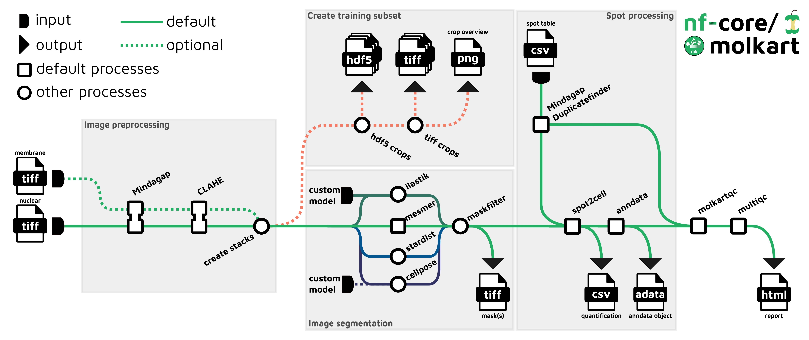

#  

[](https://github.com/nf-core/molkart/actions?query=workflow%3A%22nf-core+CI%22)
[](https://github.com/nf-core/molkart/actions?query=workflow%3A%22nf-core+linting%22)[](https://nf-co.re/molkart/results)[](https://doi.org/10.5281/zenodo.XXXXXXX)

[](https://www.nextflow.io/)
[](https://docs.conda.io/en/latest/)
[](https://www.docker.com/)
[](https://sylabs.io/docs/)
[](https://tower.nf/launch?pipeline=https://github.com/nf-core/molkart)

[](https://nfcore.slack.com/channels/molkart)[](https://twitter.com/nf_core)[](https://mstdn.science/@nf_core)[](https://www.youtube.com/c/nf-core)

## Introduction

**nf-core/molkart** is a pipeline for processing Molecular Cartography data from Resolve Bioscience (combinatorial FISH). It takes as input a table of FISH spot positions (x,y,z,gene), a corresponding DAPI image (`tiff` format) and optionally a membrane staining image in the `tiff` format. nf-core/molkart performs end-to-end processing of the data including image processing, QC filtering of spots, cell segmentation, spot-to-cell assignment and reports quality metrics such as the spot assignment rate, average spots per cell and segmentation mask size ranges.

<!-- TODO nf-core: Add docs/images/molkart_workflow.png -->
<p align="center">
    
</p>

Image preprocessing

- Fill the grid pattern in provided images ([`Mindagap`](https://github.com/ViriatoII/MindaGap))
- Optionally apply contrast-limited adaptive histogram equalization
- If a second (membrane) image is present, combine images into a multichannel stack
  Cell segmentation
- Apply cell segmentation based on provided images, available options are: - [`Cellpose`](https://www.cellpose.org/) - [`Mesmer `](https://deepcell.readthedocs.io/en/master/API/deepcell.applications.html#mesmer) - [`ilastik`](https://www.ilastik.org/)
  Spot processing
- Find duplicated spots near grid lines ([`Mindagap`](https://github.com/ViriatoII/MindaGap))
- Assign spots to segmented cells
  Quality control
- Create quality-control metrics specific to this pipeline
- provide them to ([`MultiQC`](http://multiqc.info/)) to create a report

## Usage

:::note
If you are new to Nextflow and nf-core, please refer to [this page](https://nf-co.re/docs/usage/installation) on how
to set-up Nextflow. Make sure to [test your setup](https://nf-co.re/docs/usage/introduction#how-to-run-a-pipeline)
with `-profile test` before running the workflow on actual data.
:::

First, prepare a samplesheet with your input data that looks as follows:

`samplesheet.csv`:

```csv
sample,nuclear_image,spot_locations,membrane_image
sample0,sample0_DAPI.tiff,sample0_spots.txt, sample0_WGA.tiff
```

Each row represents an FOV (field-of-view). Columns represent the sample ID (all must be unique), the path to the respective nuclear image, the spot table, and optionally the path to the respective membrane image (or any second image).

Now, you can run the pipeline using all default values with:

```bash
nextflow run nf-core/molkart \
   -profile <docker/singularity/.../institute> \
   --input samplesheet.csv \
   --outdir <OUTDIR>
```

:::warning
Please provide pipeline parameters via the CLI or Nextflow `-params-file` option. Custom config files including those
provided by the `-c` Nextflow option can be used to provide any configuration _**except for parameters**_;
see [docs](https://nf-co.re/usage/configuration#custom-configuration-files).
:::

For more details and further functionality, please refer to the [usage documentation](https://nf-co.re/molkart/usage) and the [parameter documentation](https://nf-co.re/molkart/parameters).

## Pipeline output

To see the results of an example test run with a full size dataset refer to the [results](https://nf-co.re/molkart/results) tab on the nf-core website pipeline page.
For more details about the output files and reports, please refer to the
[output documentation](https://nf-co.re/molkart/output).

## Credits

nf-core/molkart was originally written by [Florian Wuennemann](https://github.com/FloWuenne) and [Kresimir Bestak](https://github.com/kbestak).

We thank the [Maxime U Garcia](https://github.com/maxulysse) for his assistance and support in the development of this pipeline.

## Contributions and Support

If you would like to contribute to this pipeline, please see the [contributing guidelines](.github/CONTRIBUTING.md).

For further information or help, don't hesitate to get in touch on the [Slack `#molkart` channel](https://nfcore.slack.com/channels/molkart) (you can join with [this invite](https://nf-co.re/join/slack)).

## Citations

<!-- TODO nf-core: Add citation for pipeline after first release. Uncomment lines below and update Zenodo doi and badge at the top of this file. -->
<!-- If you use  nf-core/molkart for your analysis, please cite it using the following doi: [10.5281/zenodo.XXXXXX](https://doi.org/10.5281/zenodo.XXXXXX) -->

An extensive list of references for the tools used by the pipeline can be found in the [`CITATIONS.md`](CITATIONS.md) file.

You can cite the `nf-core` publication as follows:

> **The nf-core framework for community-curated bioinformatics pipelines.**
>
> Philip Ewels, Alexander Peltzer, Sven Fillinger, Harshil Patel, Johannes Alneberg, Andreas Wilm, Maxime Ulysse Garcia, Paolo Di Tommaso & Sven Nahnsen.
>
> _Nat Biotechnol._ 2020 Feb 13. doi: [10.1038/s41587-020-0439-x](https://dx.doi.org/10.1038/s41587-020-0439-x).
